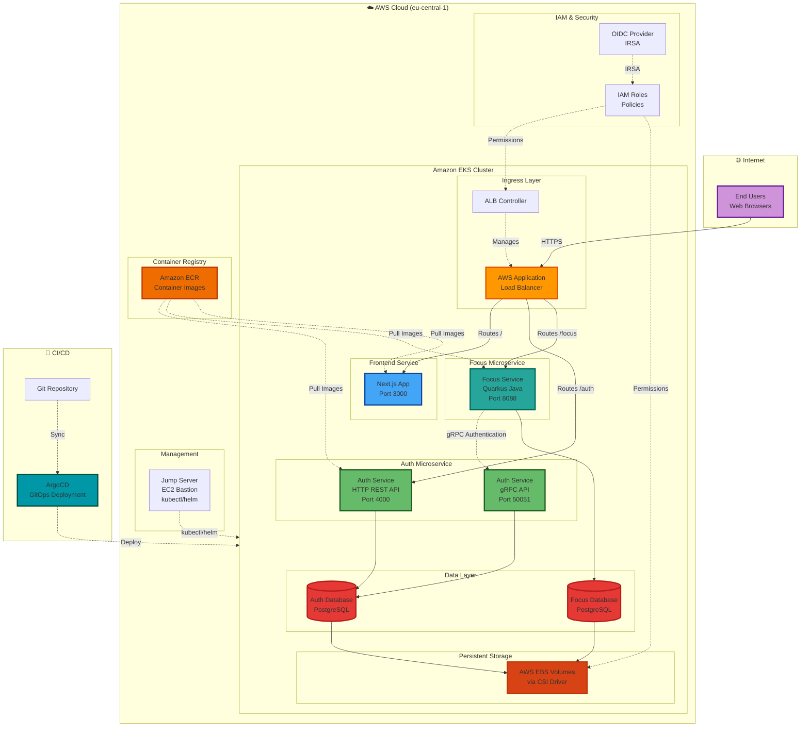
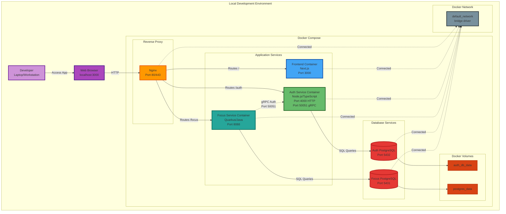
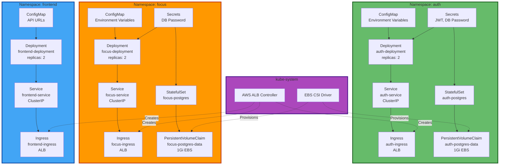

# FocusBoard - Complete System Architecture

## 🏗️ AWS EKS Production Architecture

```mermaid
graph TB
    subgraph Internet["🌐 Internet"]
        Users[End Users<br/>Web Browsers]
    end

    subgraph AWS["☁️ AWS Cloud (eu-central-1)"]
        subgraph EKS["Amazon EKS Cluster"]
            subgraph Ingress["Ingress Layer"]
                ALB[AWS Application<br/>Load Balancer]
                ALBController[ALB Controller]
            end

            subgraph Frontend["Frontend Service"]
                NextJS[Next.js App<br/>Port 3000]
            end

            subgraph AuthService["Auth Microservice"]
                AuthHTTP[Auth Service<br/>HTTP REST API<br/>Port 4000]
                AuthGRPC[Auth Service<br/>gRPC API<br/>Port 50051]
            end

            subgraph FocusService["Focus Microservice"]
                FocusApp[Focus Service<br/>Quarkus Java<br/>Port 8088]
            end

            subgraph Storage["Persistent Storage"]
                EBS[AWS EBS Volumes<br/>via CSI Driver]
            end

            subgraph Data["Data Layer"]
                AuthDB[(Auth Database<br/>PostgreSQL)]
                FocusDB[(Focus Database<br/>PostgreSQL)]
            end
        end

        subgraph Registry["Container Registry"]
            ECR[Amazon ECR<br/>Container Images]
        end

        subgraph Management["Management"]
            JumpServer[Jump Server<br/>EC2 Bastion<br/>kubectl/helm]
        end

        subgraph IAM["IAM & Security"]
            OIDC[OIDC Provider<br/>IRSA]
            IAMRoles[IAM Roles<br/>Policies]
        end
    end

    subgraph GitOps["🔄 CI/CD"]
        ArgoCD[ArgoCD<br/>GitOps Deployment]
        GitRepo[Git Repository]
    end

    %% User flows
    Users -->|HTTPS| ALB
    ALB -->|Routes /| NextJS
    ALB -->|Routes /auth| AuthHTTP
    ALB -->|Routes /focus| FocusApp

    %% Service-to-service communication
    FocusApp -.->|gRPC Authentication| AuthGRPC

    %% Data layer
    AuthHTTP --> AuthDB
    AuthGRPC --> AuthDB
    FocusApp --> FocusDB
    AuthDB --> EBS
    FocusDB --> EBS

    %% Infrastructure
    ALBController -.->|Manages| ALB
    ECR -.->|Pull Images| AuthHTTP
    ECR -.->|Pull Images| FocusApp
    ECR -.->|Pull Images| NextJS
    OIDC -.->|IRSA| IAMRoles
    IAMRoles -.->|Permissions| ALBController
    IAMRoles -.->|Permissions| EBS

    %% Management
    JumpServer -.->|kubectl/helm| EKS

    %% GitOps
    GitRepo -.->|Sync| ArgoCD
    ArgoCD -.->|Deploy| EKS

    style Users fill:#ce93d8,stroke:#6a1b9a,stroke-width:3px
    style ALB fill:#ff9800,stroke:#e65100,stroke-width:3px
    style NextJS fill:#42a5f5,stroke:#0d47a1,stroke-width:3px
    style AuthHTTP fill:#66bb6a,stroke:#1b5e20,stroke-width:3px
    style AuthGRPC fill:#66bb6a,stroke:#1b5e20,stroke-width:3px
    style FocusApp fill:#26a69a,stroke:#00695c,stroke-width:3px
    style AuthDB fill:#e53935,stroke:#b71c1c,stroke-width:3px
    style FocusDB fill:#e53935,stroke:#b71c1c,stroke-width:3px
    style ECR fill:#ef6c00,stroke:#bf360c,stroke-width:3px
    style EBS fill:#d84315,stroke:#bf360c,stroke-width:3px
    style ArgoCD fill:#0097a7,stroke:#004d40,stroke-width:3px
```

## 👨‍💻 Local Development Architecture

```mermaid
graph TB
    subgraph Developer["Local Development Environment"]
        Dev[Developer<br/>Laptop/Workstation]
        Browser[Web Browser<br/>localhost:3000]

        subgraph Docker["Docker Compose"]
            subgraph Proxy["Reverse Proxy"]
                Nginx[Nginx<br/>Port 80/443]
            end
            
            subgraph Services["Application Services"]
                LocalFrontend[Frontend Container<br/>Next.js<br/>Port 3000]
                LocalAuth[Auth Service Container<br/>Node.js/TypeScript<br/>Port 4000 HTTP<br/>Port 50051 gRPC]
                LocalFocus[Focus Service Container<br/>Quarkus/Java<br/>Port 8088]
            end

            subgraph Databases["Database Services"]
                LocalAuthDB[(Auth PostgreSQL<br/>Port 5432)]
                LocalFocusDB[(Focus PostgreSQL<br/>Port 5431)]
            end

            subgraph Volumes["Docker Volumes"]
                AuthData[auth_db_data]
                FocusData[postgres_data]
            end
        end

        subgraph Network["Docker Network"]
            Bridge[default_network<br/>bridge driver]
        end
    end

    %% Developer workflow
    Dev -->|Access App| Browser

    %% User flows
    Browser -->|HTTP| Nginx
    
    %% Nginx routing
    Nginx -->|Routes /| LocalFrontend
    Nginx -->|Routes /auth| LocalAuth
    Nginx -->|Routes /focus| LocalFocus

    %% Service communication
    LocalFocus -.->|gRPC Auth<br/>Port 50051| LocalAuth

    %% Database connections
    LocalAuth -->|SQL Queries| LocalAuthDB
    LocalFocus -->|SQL Queries| LocalFocusDB

    %% Storage
    LocalAuthDB --> AuthData
    LocalFocusDB --> FocusData

    %% Network
    Nginx -.->|Connected| Bridge
    LocalFrontend -.->|Connected| Bridge
    LocalAuth -.->|Connected| Bridge
    LocalFocus -.->|Connected| Bridge
    LocalAuthDB -.->|Connected| Bridge
    LocalFocusDB -.->|Connected| Bridge

    style Dev fill:#ce93d8,stroke:#6a1b9a,stroke-width:3px
    style Browser fill:#ab47bc,stroke:#4a148c,stroke-width:3px
    style Nginx fill:#ff9800,stroke:#e65100,stroke-width:3px
    style LocalFrontend fill:#42a5f5,stroke:#0d47a1,stroke-width:3px
    style LocalAuth fill:#66bb6a,stroke:#1b5e20,stroke-width:3px
    style LocalFocus fill:#26a69a,stroke:#00695c,stroke-width:3px
    style LocalAuthDB fill:#e53935,stroke:#b71c1c,stroke-width:3px
    style LocalFocusDB fill:#e53935,stroke:#b71c1c,stroke-width:3px
    style AuthData fill:#d84315,stroke:#bf360c,stroke-width:3px
    style FocusData fill:#d84315,stroke:#bf360c,stroke-width:3px
    style Bridge fill:#78909c,stroke:#263238,stroke-width:3px
```

## 📦 Deployment Architecture

### Kubernetes Resources

```mermaid
graph TB
    subgraph Namespace_Auth["Namespace: auth"]
        AuthDeploy[Deployment<br/>auth-deployment<br/>replicas: 2]
        AuthService[Service<br/>auth-service<br/>ClusterIP]
        AuthIngress[Ingress<br/>auth-ingress<br/>ALB]
        AuthConfigMap[ConfigMap<br/>Environment Variables]
        AuthSecrets[Secrets<br/>JWT, DB Password]
        AuthPVC[PersistentVolumeClaim<br/>auth-postgres-data<br/>1Gi EBS]
        AuthStatefulSet[StatefulSet<br/>auth-postgres]
    end

    subgraph Namespace_Focus["Namespace: focus"]
        FocusDeploy[Deployment<br/>focus-deployment<br/>replicas: 2]
        FocusService[Service<br/>focus-service<br/>ClusterIP]
        FocusIngress[Ingress<br/>focus-ingress<br/>ALB]
        FocusConfigMap[ConfigMap<br/>Environment Variables]
        FocusSecrets[Secrets<br/>DB Password]
        FocusPVC[PersistentVolumeClaim<br/>focus-postgres-data<br/>1Gi EBS]
        FocusStatefulSet[StatefulSet<br/>focus-postgres]
    end

    subgraph Namespace_Frontend["Namespace: frontend"]
        FrontendDeploy[Deployment<br/>frontend-deployment<br/>replicas: 2]
        FrontendService[Service<br/>frontend-service<br/>ClusterIP]
        FrontendIngress[Ingress<br/>frontend-ingress<br/>ALB]
        FrontendConfigMap[ConfigMap<br/>API URLs]
    end

    subgraph KubeSystem["kube-system"]
        ALBControllerPod[AWS ALB Controller]
        EBSDriverPod[EBS CSI Driver]
    end

    AuthConfigMap --> AuthDeploy
    AuthSecrets --> AuthDeploy
    AuthDeploy --> AuthService
    AuthService --> AuthIngress
    AuthStatefulSet --> AuthPVC
    AuthSecrets --> AuthStatefulSet

    FocusConfigMap --> FocusDeploy
    FocusSecrets --> FocusDeploy
    FocusDeploy --> FocusService
    FocusService --> FocusIngress
    FocusStatefulSet --> FocusPVC
    FocusSecrets --> FocusStatefulSet

    FrontendConfigMap --> FrontendDeploy
    FrontendDeploy --> FrontendService
    FrontendService --> FrontendIngress

    ALBControllerPod -.->|Creates| AuthIngress
    ALBControllerPod -.->|Creates| FocusIngress
    ALBControllerPod -.->|Creates| FrontendIngress
    EBSDriverPod -.->|Provisions| AuthPVC
    EBSDriverPod -.->|Provisions| FocusPVC

    style Namespace_Auth fill:#66bb6a,stroke:#1b5e20,stroke-width:3px
    style Namespace_Focus fill:#ff9800,stroke:#bf360c,stroke-width:3px
    style Namespace_Frontend fill:#42a5f5,stroke:#0d47a1,stroke-width:3px
    style KubeSystem fill:#ab47bc,stroke:#4a148c,stroke-width:3px
```
