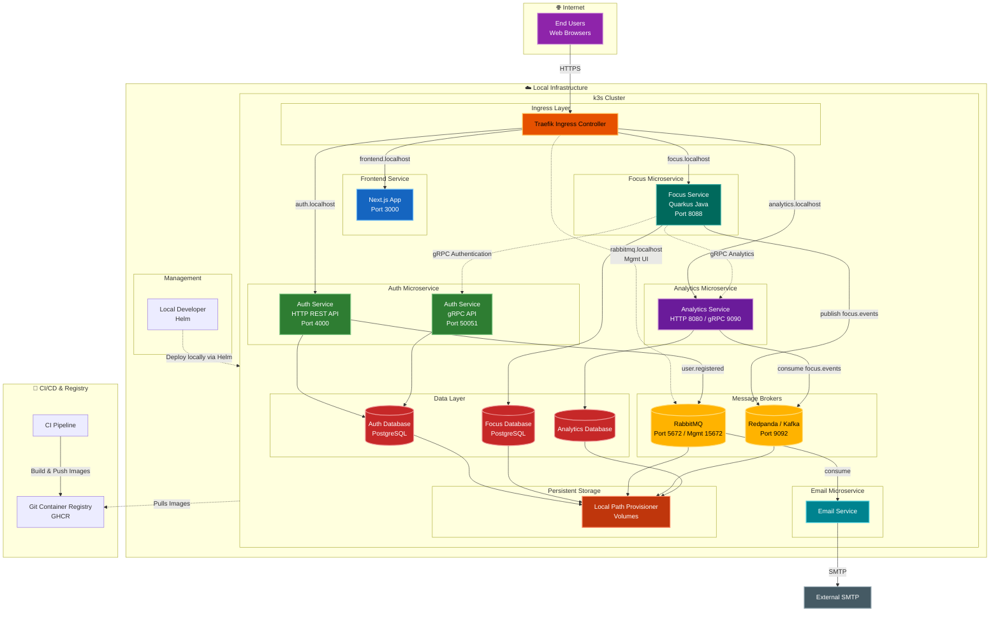
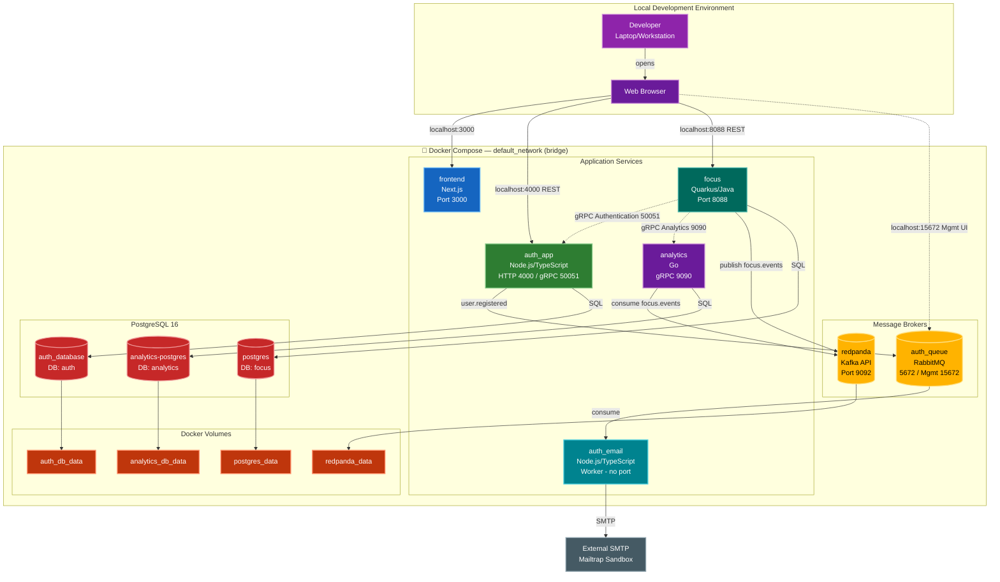

# FocusBoard - Complete System Architecture

## 🏗️ Kubernetes Architecture (k3s)

This configuration models the localized k3s architecture, utilizing Helm for direct deployments.

## 👨‍💻 Local Development Architecture

This setup is defined in [docker/compose.yml](docker/compose.yml). All containers share a
single `default_network` (bridge).

