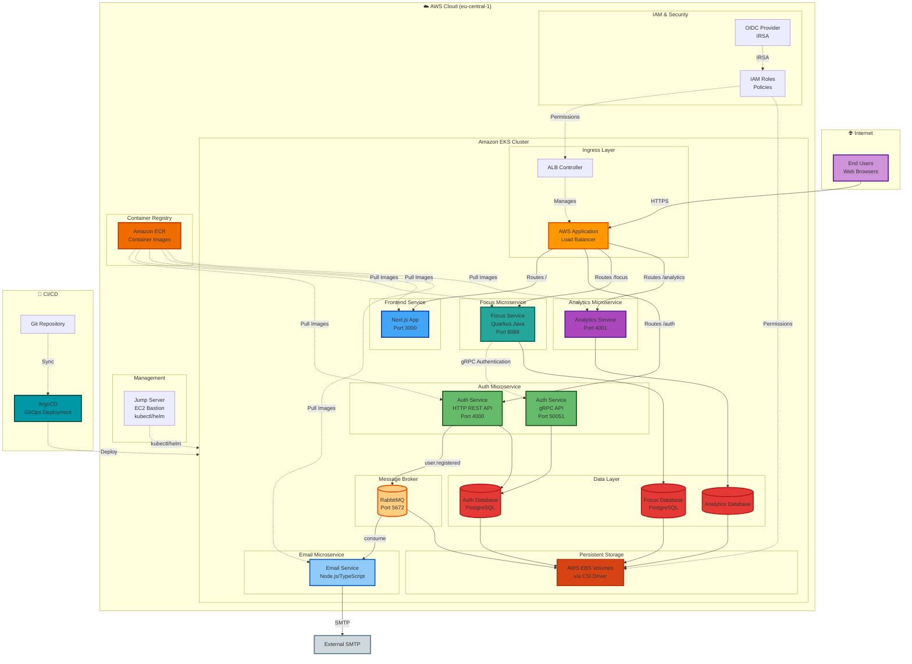

## 🏗️ AWS EKS Production Architecture

```mermaid
graph TB
    subgraph Internet["🌐 Internet"]
        Users[End Users<br/>Web Browsers]
    end

    subgraph AWS["☁️ AWS Cloud (eu-central-1)"]
        subgraph EKS["Amazon EKS Cluster"]
            subgraph Ingress["Ingress Layer"]
                ALB[AWS Application<br/>Load Balancer]
                ALBController[ALB Controller]
            end

            subgraph Frontend["Frontend Service"]
                NextJS[Next.js App<br/>Port 3000]
            end

            subgraph AuthService["Auth Microservice"]
                AuthHTTP[Auth Service<br/>HTTP REST API<br/>Port 4000]
                AuthGRPC[Auth Service<br/>gRPC API<br/>Port 50051]
            end

            subgraph FocusService["Focus Microservice"]
                FocusApp[Focus Service<br/>Quarkus Java<br/>Port 8088]
            end

            subgraph EmailService["Email Microservice"]
                EmailApp[Email Service<br/>Node.js/TypeScript]
            end

            subgraph AnalyticsService["Analytics Microservice"]
                AnalyticsApp[Analytics Service<br/>Port 4001]
            end

            subgraph MessageBroker["Message Broker"]
                RabbitMQ[(RabbitMQ<br/>Port 5672)]
            end

            subgraph Storage["Persistent Storage"]
                EBS[AWS EBS Volumes<br/>via CSI Driver]
            end

            subgraph Data["Data Layer"]
                AuthDB[(Auth Database<br/>PostgreSQL)]
                FocusDB[(Focus Database<br/>PostgreSQL)]
                AnalyticsDB[(Analytics Database)]
            end
        end

        subgraph Registry["Container Registry"]
            ECR[Amazon ECR<br/>Container Images]
        end

        subgraph Management["Management"]
            JumpServer[Jump Server<br/>EC2 Bastion<br/>kubectl/helm]
        end

        subgraph IAM["IAM & Security"]
            OIDC[OIDC Provider<br/>IRSA]
            IAMRoles[IAM Roles<br/>Policies]
        end
    end

    subgraph GitOps["🔄 CI/CD"]
        ArgoCD[ArgoCD<br/>GitOps Deployment]
        GitRepo[Git Repository]
    end

    %% User flows
    Users -->|HTTPS| ALB
    ALB -->|Routes /| NextJS
    ALB -->|Routes /auth| AuthHTTP
    ALB -->|Routes /focus| FocusApp
    ALB -->|Routes /analytics| AnalyticsApp

    %% Service-to-service communication
    FocusApp -.->|gRPC Authentication| AuthGRPC

    %% Async Communication
    AuthHTTP -->|user.registered| RabbitMQ
    RabbitMQ -->|consume| EmailApp

    %% External Services
    EmailApp -->|SMTP| ExternalSMTP[External SMTP]

    %% Data layer
    AuthHTTP --> AuthDB
    AuthGRPC --> AuthDB
    FocusApp --> FocusDB
    AnalyticsApp --> AnalyticsDB
    AuthDB --> EBS
    FocusDB --> EBS
    AnalyticsDB --> EBS
    RabbitMQ --> EBS

    %% Infrastructure
    ALBController -.->|Manages| ALB
    ECR -.->|Pull Images| AuthHTTP
    ECR -.->|Pull Images| FocusApp
    ECR -.->|Pull Images| NextJS
    ECR -.->|Pull Images| EmailApp
    ECR -.->|Pull Images| AnalyticsApp
    OIDC -.->|IRSA| IAMRoles
    IAMRoles -.->|Permissions| ALBController
    IAMRoles -.->|Permissions| EBS

    %% Management
    JumpServer -.->|kubectl/helm| EKS

    %% GitOps
    GitRepo -.->|Sync| ArgoCD
    ArgoCD -.->|Deploy| EKS

    style Users fill:#ce93d8,stroke:#6a1b9a,stroke-width:3px
    style ALB fill:#ff9800,stroke:#e65100,stroke-width:3px
    style NextJS fill:#42a5f5,stroke:#0d47a1,stroke-width:3px
    style AuthHTTP fill:#66bb6a,stroke:#1b5e20,stroke-width:3px
    style AuthGRPC fill:#66bb6a,stroke:#1b5e20,stroke-width:3px
    style FocusApp fill:#26a69a,stroke:#00695c,stroke-width:3px
    style EmailApp fill:#90caf9,stroke:#1565c0,stroke-width:3px
    style AnalyticsApp fill:#ab47bc,stroke:#6a1b9a,stroke-width:3px
    style AuthDB fill:#e53935,stroke:#b71c1c,stroke-width:3px
    style FocusDB fill:#e53935,stroke:#b71c1c,stroke-width:3px
    style AnalyticsDB fill:#e53935,stroke:#b71c1c,stroke-width:3px
    style RabbitMQ fill:#ffcc80,stroke:#e65100,stroke-width:3px
    style ExternalSMTP fill:#cfd8dc,stroke:#607d8b,stroke-width:3px
    style ECR fill:#ef6c00,stroke:#bf360c,stroke-width:3px
    style EBS fill:#d84315,stroke:#bf360c,stroke-width:3px
    style ArgoCD fill:#0097a7,stroke:#004d40,stroke-width:3px
```

### Kubernetes Resources

```mermaid
graph TB
    subgraph Namespace_Auth["Namespace: auth"]
        AuthDeploy[Deployment<br/>auth-deployment]
        AuthService[Service<br/>auth-service<br/>ClusterIP]
        AuthIngress[Ingress<br/>auth-ingress<br/>ALB]
        AuthConfigMap[ConfigMap<br/>Environment Variables]
        AuthSecrets[Secrets<br/>JWT, DB Password]
        AuthPVC[PersistentVolumeClaim<br/>auth-postgres-data<br/>1Gi EBS]
        AuthStatefulSet[StatefulSet<br/>auth-postgres]
    end

    subgraph Namespace_Focus["Namespace: focus"]
        FocusDeploy[Deployment<br/>focus-deployment]
        FocusService[Service<br/>focus-service<br/>ClusterIP]
        FocusIngress[Ingress<br/>focus-ingress<br/>ALB/Traefik]
        FocusConfigMap[ConfigMap<br/>Environment Variables]
        FocusSecrets[Secrets<br/>DB Password]
        FocusPVC[PersistentVolumeClaim<br/>focus-postgres-data<br/>1Gi Storage]
        FocusStatefulSet[StatefulSet<br/>focus-postgres]
    end

    subgraph Namespace_Frontend["Namespace: frontend"]
        FrontendDeploy[Deployment<br/>frontend-deployment]
        FrontendService[Service<br/>frontend-service<br/>ClusterIP]
        FrontendIngress[Ingress<br/>frontend-ingress<br/>ALB/Traefik]
        FrontendConfigMap[ConfigMap<br/>API URLs]
    end

    subgraph Namespace_Email["Namespace: email"]
        EmailDeploy[Deployment<br/>email-deployment]
        EmailConfigMap[ConfigMap<br/>SMTP Settings]
        EmailSecrets[Secrets<br/>SMTP Passwords]
    end

    subgraph Namespace_Analytics["Namespace: analytics"]
        AnalyticsDeploy[Deployment<br/>analytics-deployment]
        AnalyticsService[Service<br/>analytics-service<br/>ClusterIP]
        AnalyticsIngress[Ingress<br/>analytics-ingress<br/>ALB/Traefik]
    end

    subgraph Namespace_Infrastructure["Namespace: infra"]
        RabbitMQStatefulSet[StatefulSet<br/>rabbitmq]
        RabbitMQService[Service<br/>rabbitmq-service<br/>ClusterIP]
        RabbitMQPVC[PersistentVolumeClaim<br/>rabbitmq-data]
    end

    subgraph KubeSystem["kube-system / utilities"]
        IngressControllerPod[ALB Controller / Traefik]
        CSIDriverPod[EBS CSI Driver / Local Path]
    end

    AuthConfigMap --> AuthDeploy
    AuthSecrets --> AuthDeploy
    AuthDeploy --> AuthService
    AuthService --> AuthIngress
    AuthStatefulSet --> AuthPVC
    AuthSecrets --> AuthStatefulSet

    FocusConfigMap --> FocusDeploy
    FocusSecrets --> FocusDeploy
    FocusDeploy --> FocusService
    FocusService --> FocusIngress
    FocusStatefulSet --> FocusPVC
    FocusSecrets --> FocusStatefulSet

    FrontendConfigMap --> FrontendDeploy
    FrontendDeploy --> FrontendService
    FrontendService --> FrontendIngress

    EmailConfigMap --> EmailDeploy
    EmailSecrets --> EmailDeploy

    AnalyticsDeploy --> AnalyticsService
    AnalyticsService --> AnalyticsIngress

    IngressControllerPod -.->|Creates| AuthIngress
    IngressControllerPod -.->|Creates| FocusIngress
    IngressControllerPod -.->|Creates| FrontendIngress
    IngressControllerPod -.->|Creates| AnalyticsIngress
    CSIDriverPod -.->|Provisions| AuthPVC
    CSIDriverPod -.->|Provisions| FocusPVC
    CSIDriverPod -.->|Provisions| RabbitMQPVC

    style Namespace_Auth fill:#66bb6a,stroke:#1b5e20,stroke-width:3px
    style Namespace_Focus fill:#ff9800,stroke:#bf360c,stroke-width:3px
    style Namespace_Frontend fill:#42a5f5,stroke:#0d47a1,stroke-width:3px
    style Namespace_Email fill:#90caf9,stroke:#1565c0,stroke-width:3px
    style Namespace_Analytics fill:#ab47bc,stroke:#6a1b9a,stroke-width:3px
    style Namespace_Infrastructure fill:#ffcc80,stroke:#e65100,stroke-width:3px
    style KubeSystem fill:#ab47bc,stroke:#4a148c,stroke-width:3px
```
